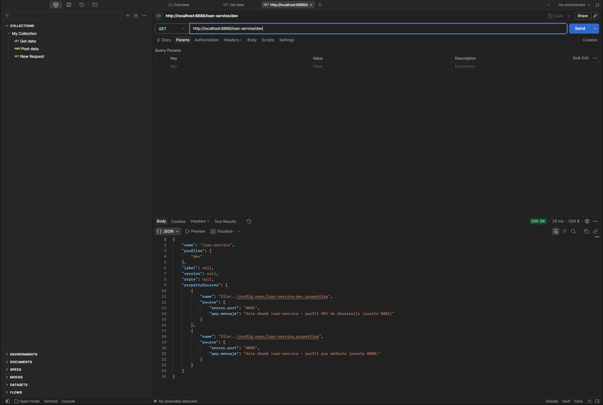
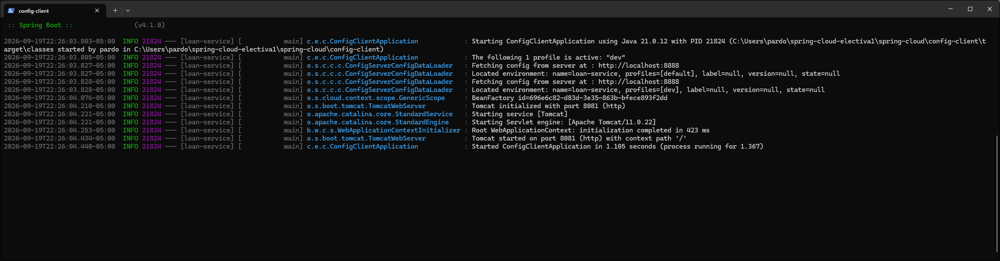
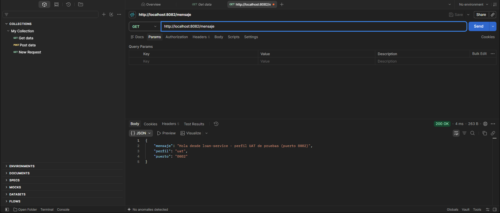

# Spring Cloud Config - Taller Electiva I

Taller de configuración centralizada con Spring Cloud: un **Config Server** que sirve las propiedades y un **Config Client** (`loan-service`) que las consume.

## Estructura

- `config-server/`: servidor de configuración (puerto 8888)
- `config-client/`: cliente `loan-service`
- `config-repo/`: archivos `.properties` que sirve el servidor

## Ejecución

Requisitos: Java 21 y Maven.

1. Iniciar el servidor:
   ```
   cd config-server
   mvn spring-boot:run
   ```
2. En otra terminal, iniciar el cliente:
   ```
   cd config-client
   mvn spring-boot:run
   ```

Para probar otro perfil (`dev`, `uat` o `default`):
```
mvn spring-boot:run "-Dspring-boot.run.arguments=--spring.profiles.active=uat"
```

Luego abrir `http://localhost:8082/mensaje` (puerto 8080 para `default`, 8081 para `dev`, 8082 para `uat`).

## Evidencias

**1. Config Server** entrega la configuración del perfil `dev` (`http://localhost:8888/loan-service/dev`):



**2. Config Client** (perfil `dev`) pide su configuración al servidor y arranca en el puerto 8081:



**3. Perfil `dev`:** `http://localhost:8081/mensaje`


**4. Perfil `uat`:** `http://localhost:8082/mensaje`



**5. Perfil `default`:** `http://localhost:8080/mensaje`


Más detalle en [INFORME.md](INFORME.md) y en el informe en Word: [Informe-Taller-Spring-Cloud.docx](Informe-Taller-Spring-Cloud.docx).
